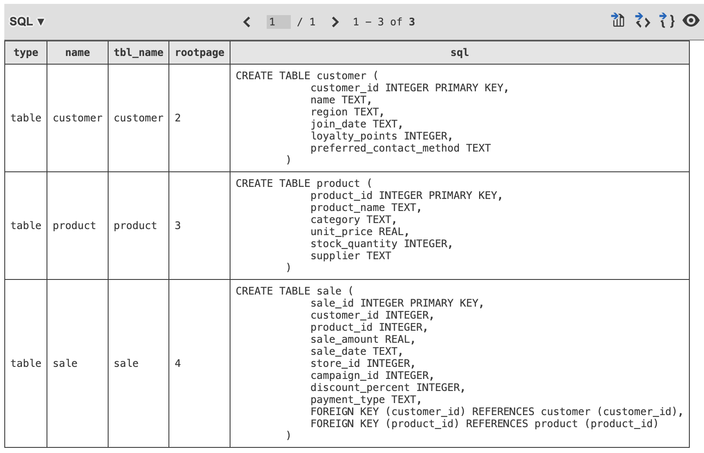

# smart-store-kyleroof
P1. BI Python (01-Setup Machine, 02-Initialize Project, Organize)

01-git-pull-before-changes.md
git pull origin main

02-activate-virtual-environment.md
source .venv/bin/activate

task-1-activate-upgrade-install
source .venv/bin/activate
python3 -m pip install --upgrade pip setuptools wheel
python3 -m pip install -r requirements.txt

task-2-activate-execute
source .venv/bin/activate
python3 filename.py

06-git-add-commit-push.md
git add .
git commit -m "Descripiton"
git push -u origin main

After subsequent changes may use
git push

Execute python script
python3 scripts/data_prep.py

Smart Sales Data Warehouse

1. Project Overview

Brief summary of the Smart Sales data warehouse and what it accomplishes.

2. Design Choices
	•	Why you used SQLite
	•	Why you used pandas and Python for the ETL process
	•	Folder structure and organization
	•	Naming conventions (e.g., snake_case for consistency between code and schema)

3. Schema Implementation
	•	Description of each table: customer, product, sale
	•	Keys and relationships (foreign keys)
	•	Normalization decisions

4. ETL Process
	•	Source of the .csv files
	•	Transformations performed (e.g., renaming columns, cleaning formats)
	•	Load process into SQLite

5. Screenshot of Schema

(Once you attach, I’ll reference it here)

6. Challenges Encountered
	•	Column name mismatches between CSVs and schema
	•	SQLite foreign key constraints
	•	Schema not updating due to leftover DB file
	•	Learning curve with pandas .to_sql() and debugging insert issues

7. Future Improvements
	•	Add validation/logging
	•	Switch to PostgreSQL or other RDBMS for production
	•	Automate schema migrations

Screenshot of tables

