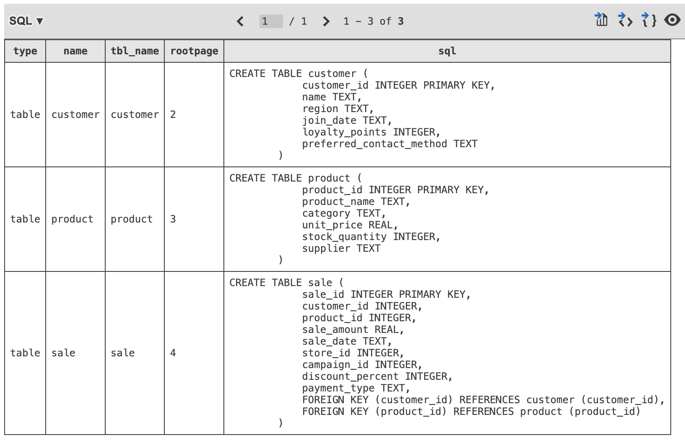

# smart-store-kyleroof
P1. BI Python (01-Setup Machine, 02-Initialize Project, Organize)

01-git-pull-before-changes.md
git pull origin main

02-activate-virtual-environment.md
source .venv/bin/activate

task-1-activate-upgrade-install
source .venv/bin/activate
python3 -m pip install --upgrade pip setuptools wheel
python3 -m pip install -r requirements.txt

task-2-activate-execute
source .venv/bin/activate
python3 filename.py

06-git-add-commit-push.md
git add .
git commit -m "Descripiton"
git push -u origin main

After subsequent changes may use
git push

Execute python script
python3 scripts/data_prep.py

Smart Sales Data Warehouse

1. Project Overview

Brief summary of the Smart Sales data warehouse and what it accomplishes.

2. Design Choices
	•	Why you used SQLite
	•	Why you used pandas and Python for the ETL process
	•	Folder structure and organization
	•	Naming conventions (e.g., snake_case for consistency between code and schema)

3. Schema Implementation
	•	Description of each table: customer, product, sale
	•	Keys and relationships (foreign keys)
	•	Normalization decisions

4. ETL Process
	•	Source of the .csv files
	•	Transformations performed (e.g., renaming columns, cleaning formats)
	•	Load process into SQLite

5. Screenshot of Schema

1. Challenges Encountered
	•	Column name mismatches between CSVs and schema
	•	SQLite foreign key constraints
	•	Schema not updating due to leftover DB file
	•	Learning curve with pandas .to_sql() and debugging insert issues

2. Future Improvements
	•	Add validation/logging
	•	Switch to PostgreSQL or other RDBMS for production
	•	Automate schema migrations

Screenshot of tables

SQL Queries and Reports
The first query joins the sale and customer tables to calculate total revenue per customer. The second analysis groups sales by product and region to understand category performance.

Dashboard Design Choices
I used a bar chart to highlight top-spending customers for clear comparison and a line chart to show sales trends over time. I grouped sales by region and product category to identify regional strengths.

Screenshots of Spark SQL Schema and Query Results
/Users/kyleroof/Projects/smart-store-kyleroof/screenshots/df_sales.png
/Users/kyleroof/Projects/smart-store-kyleroof/screenshots/df_filtered.png
/Users/kyleroof/Projects/smart-store-kyleroof/screenshots/df_combined.png
/Users/kyleroof/Projects/smart-store-kyleroof/screenshots/df_sales_drill.png
/Users/kyleroof/Projects/smart-store-kyleroof/screenshots/df_top_customers.png

Screenshots of Final Dashboard/Charts
/Users/kyleroof/Projects/smart-store-kyleroof/screenshots/plt_monthly_sales_by_year.png
/Users/kyleroof/Projects/smart-store-kyleroof/screenshots/plt_top_customers_by_spend.png

# Product Performance Analysis Across Regions and Time

## 1. Business Goal
The goal of this project is to analyze product sales across different regions and over time to understand what’s performing well, where, and when. This kind of insight is super valuable for making smarter decisions around inventory, promotions, and marketing—especially if you're trying to boost sales or optimize stock levels in specific areas.

## 2. Data Source
I worked with a local SQLite data warehouse (`smart_sales.db`) that included three main tables:
- `customer`: Used `customer_id`, `region`
- `product`: Used `product_id`, `category`, `supplier`
- `sale`: Used `sale_id`, `product_id`, `customer_id`, `sale_date`, `sale_amount`, and `discount_percent`

These gave me everything I needed to connect product purchases to regions and time periods for analysis.

## 3. Tools
I used **Python** in a **Jupyter Notebook**, pulling data from SQLite with `sqlite3` and `pandas`, then visualizing it with `matplotlib` and `seaborn`. I chose this stack because it's flexible, great for exploration, and easy to use for slicing/dicing large datasets.

## 4. Workflow and Logic
I joined all three tables into one dataset and focused on three key dimensions:
- **Product Category**
- **Region**
- **Time (monthly using sale_date)**

I aggregated `sale_amount` across these dimensions to see:
- Total sales by product category (slicing)
- Sales by category and region (dicing)
- Monthly sales trend for the top category (drill-down)

## 5. Results
The analysis showed that **Electronics is the top-performing category**, especially in the **East and South** regions. There was also a big **sales spike in July**, likely tied to a campaign or seasonal demand. Clothing did okay, but Sports barely moved the needle.

Visualizations included:
- Bar chart for sales by category
- /Users/kyleroof/Projects/smart-store-kyleroof/screenshots/total_sales_by_product_category.png
- Heatmap for sales by region and category
- /Users/kyleroof/Projects/smart-store-kyleroof/screenshots/sales_by_category_and_region.png
- Line chart for monthly trend of top category
- /Users/kyleroof/Projects/smart-store-kyleroof/screenshots/monthly_sales_trend_for_top_category.png

These helped clearly show what’s selling well and when.

## 6. Suggested Business Action
- Focus inventory and promotions for Electronics in the East and South.
- Investigate what caused the July spike and consider replicating that campaign.
- Evaluate the Sports category to decide if it’s worth keeping or just needs better visibility.

## 7. Challenges
I ran into a few setup issues—initially had trouble with the file path and forgot to close some quotes in the code, which threw syntax errors. Also had to remember to install and import all the right libraries. Once I switched Markdown and code into the right cells in Jupyter and cleaned up the formatting, everything ran smoothly.

---